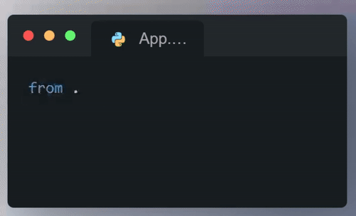

.. _Contribute and Extend RAI:

=============================
**Contribute and Extend RAI**
=============================

- **How to contribute and extend RAI (User Guide)**

**Adding Metric Group**
-----------------------

**What are its requirements?**

- To add a New metrics, we need to create 3 files inside Metrics

 - **__init__.py file**.
 - **json file**. 
 - **Python file**.

- In ``__init__.py`` file - we have to import the py file that we have created inside the folder

 **Example:** 

   __init__.py file example.

**How to expand RAI using Metric group**

- Inside ``json file``, we need to  define parametrs as name, display_name, compatibility, dependency_list, tags, complexity_class, metrics.

 
  :parameter: name:
  :parameter: display_name:
  :parameter: compatibility:
  :parameter: dependency_list:
  :parameter: tags:
  :parameter: complexity_class:
  :parameter: metrics:

 
 
**Example:** 

.. figure:: /images/json_metric.png
   :class: with-border
   :scale: 40 %
   :align: center

   json_metric file example.

**Create subclass of class and implement the method**

- We can create subclass of class and implement the methods

- In ``python file`` , we need to create a class for respective metric_group and we need to define methods for update and compute inside the class.

**Example:** 

.. figure:: /images/metric_pyfile.png
   :class: with-border
   :scale: 40 %
   :align: center

   metric_python_file example.

**Adding Certificates**
-----------------------

**What are is requirements**

- To add a New Certificates , we need to create a json file inside a standard folder

**How to expand RAI using Certificates**

- For certificates there are two key value pairs , first one meta and second one conditions.
- Inside meta we need to give diplay name, description, tags and level
- Inside condition we need to give operator and terms.

**create a certificate and implement** 

- Inside certificate folder, go to standard folder and their make a ``json file`` and fill all given parameters.

  :parameter: meta:
  :parameter: condition:
  

**Example:** 

.. figure:: /images/add_certficate.png
   :class: with-border
   :scale: 60 %
   :align: center

   sample certficate .

**Adding Analysis**
-------------------

**What are is requirements?**

- How to expand RAI using Analysis
- To add a New Analysis, we need to create 3 files inside Analysis folder

 - **__init__.py file**.
 - **json file**. 
 - **Python file**.

- In ``__init__.py`` file - we have to import the py file that we have created inside the folder

**Example:** 

   __init__.py file example.

**How to expand RAI using Analysis**
 
- Inside ``json file``, we need to give parametrs name, display_name, compatibility, src, dependency_list, tags, complexity_class.

  :parameter: name:
  :parameter: display_name:
  :parameter: compatibility:
  :parameter: src:
  :parameter: dependency_list:
  :parameter: tags:
  :parameter: complexity_class:

**Example:** 

.. figure:: /images/Analysis_json_file.png
   :class: with-border
   :scale: 70 %
   :align: center

   Analysis_json_file example.

**create subclass of class and implement the method**

- We can create subclass of class and implement the methods

- In ``python file`` , we need to create a class for respective Analysis and we need to define methods for initialize  ,compute, to_string, to_html inside the class.

**Example:** 

.. figure:: /images/Analysispyfile.png
   :class: with-border
   :scale: 60 %
   :align: center

   Analysispyfile.png example

================================================
**Contribution of users to expand its features**
================================================

**Contributing to RAI**
-----------------------

Thank you for taking time to start contributing! We want to make contributing to this project as easy and transparent as possible, whether it's:

- Reporting a bug
- Discussing the current state of the code
- Submitting a fix
- Proposing new features
- Becoming a maintainer

**We Develop with Github**
--------------------------

We use github to host code, to track issues and feature requests, as well as accept pull requests.

Pull requests are the best way to propose changes to the codebase. We actively welcome your pull requests:

1. Fork the repo and create your branch from `master`.
2. If you've added code that should be tested, add tests.
3. If you've changed APIs, update the documentation.
4. Ensure the test suite passes.
5. Make sure your code lints.
6. Issue that pull request!

**Any contributions you make will be under the Apache License, Version 2**
--------------------------------------------------------------------------

- In short, when you submit code changes, your submissions are understood to be under the same `Apache License <https://github.com/cisco-open/ResponsibleAI/blob/main/LICENSE>`_ that covers the project.
- Feel free to contact the maintainers if that's a concern.

**Report bugs using Github's** `Issues <https://github.com/cisco-open/ResponsibleAI/issues>`_
---------------------------------------------------------------------------------------------

- We use GitHub issues to track public bugs. Report a bug by `opening a new issue <https://github.com/cisco-open/ResponsibleAI/issues/new>`_

- Write bug reports with detail, background, and sample code.

Please consider to include the following in a bug report:

- A quick summary and/or background
- Steps to reproduce
  - Be specific!
  - Give sample code if you can.
- What you expected would happen
- What actually happened
- Notes (possibly including why you think this might be happening, or stuff you tried that didn't work)

 
**License**
-----------

- By contributing, you agree that your contributions will be licensed under its `Apache License <https://github.com/cisco-open/ResponsibleAI/blob/main/LICENSE>`_, Version 2.

**References**
--------------

- This document was adapted from  `here <https://gist.github.com/briandk/3d2e8b3ec8daf5a27a62>`_.

